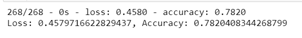
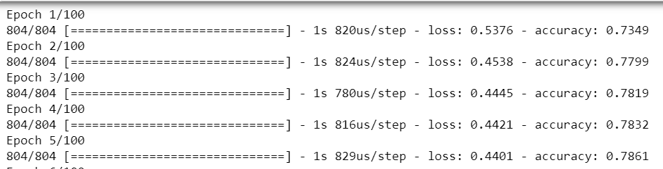

# Charity Funding Predictor Report

# Overview
The goal of this project was to predict whether applicants are successful whenever they received funding from alphabet soup, a nonprofit foundation. In order to do this, a dataset of 34,000 organization applications that have previously used funding from alphabet soup was procured. A deep learning model was been created to try and successfully predict the outcomes and help save money for alphabet soup when possible.

# Optimization Results

## Data Processing
* The target of this model is the `IS_SUCCESSFUL` feature given the goal is to predict successful partners for Alphabet Soup.
* The features of the model are `APPLICATION_TYPE`, `AFFILIATION`, `CLASSIFICATION`, `USE_CASE`, `ORGANIZATION`, `STATUS`, `INCOME_AMT`, and `ASK_AMT`
* The variables removed from the model were `EIN` and `Special_Circumstances`.

## Compiling, Training, and Evaluating the Model
* The model has 2 Hidden Layers. The first with 10 Neurons and the second with 20. These numbers were chosen because the first layer was to have a similar amount of neurons to features in the model. For the second layer, the number was doubled in order for the model to train the data longer. Lastly, because the data is not incredibly complex, the number of hidden layers was kept at two.
* By binning the name of the applicant and dropping the `Special_Considerations` feature, The model was able to reach an accuracy level of .7820 or 78.20%.
* Similar to what has been stated above, the tactics used to increase the model performance was to decrease the number of outliers the model was training. By binning the name of the applicants and discarding any with less than 10 applications, the data could be seen as more accurate. Additionally, the  `Special_Considerations` feature was removed as it could also produce more outliers as there are instances where they would not apply to other applicants. 

    

    

## Summary
The results of the deep learning model were respectable. Being able to predict the target of an applicants success at almost an 80% success rate is substantive for this type of data. In terms of recommendations for how a different model could work better, adding another hidden layer and experimenting with the number of neurons and activation type would be a good place to start. This may offer the model more iterations when training the data so there is more accuracy when testing.